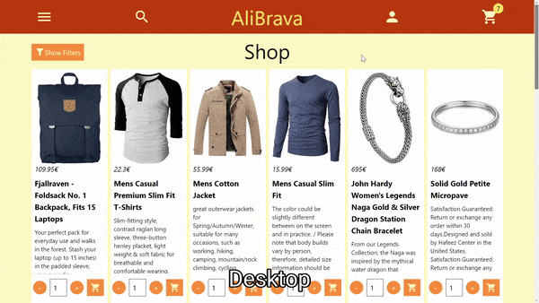

# Shopping Cart (React E-commerce Site)

This project is part of the [Odin Project's](https://www.theodinproject.com/) React curriculum. It's an e-commerce website that showcases client-side routing with React Router, responsive design using Tailwind CSS, and state management with the Context API.

## Usage

|                               Mobile Usage                                |                                                                  Tablet and Desktop Usage                                                                  |
| :-----------------------------------------------------------------------: | :--------------------------------------------------------------------------------------------------------------------------------------------------------: |
|  |     |

## Key Features

### React Client-Side Routing with React Router

- **Dynamic Routing**: Utilized React Router v6 for seamless navigation without page reloads, providing a SPA (Single Page Application) experience.
- **Nested Routes**: Implemented nested routes for product details, ensuring a structured and maintainable route hierarchy.
- **Route Parameters**: Employed route parameters to dynamically render product details, enabling a cleaner and more dynamic codebase.

### First Experience with Tailwind CSS

- **Responsive Design**: Embraced Tailwind CSS for its utility-first approach, which made it easier to build a responsive layout. This project followed a mobile-first development strategy, ensuring the site is fully functional and visually appealing on smaller screens before scaling up to larger devices.
- **Custom Tailwind Extensions**: Extended Tailwind's configuration to include custom utilities, taking advantage of the framework's versatility.

### Introduction to React Context

- **Global State Management**: Leveraged the Context API to manage global states like cart items, avoiding prop-drilling and ensuring efficient state updates across components.
- **Contextual Data Passing**: Used the Context API to pass data through the component tree without explicitly passing props at every level, simplifying the data flow and component structure.

### Technical Highlights

- **Search Functionality**: Implemented a real-time search feature, allowing users to find products quickly based on titles. This feature leverages the useParams hook to dynamically capture and handle search queries.
- **Category Filtering**: Developed a dynamic filtering system, enabling users to view products by selected categories.
- **Cart Management**: Integrated a shopping cart feature, complete with add, remove, and quantity adjustment capabilities.
- **Data Fetching & Error Handling**: Fetched product data from an API and handled potential fetch errors, ensuring a robust data retrieval system.
- **Custom Hook for Item Quantities**: Developed a custom React hook, useItemQuantity, to manage item quantities in the cart. This hook encapsulates the logic for incrementing, decrementing, and updating quantities, making the code more reusable and cleaner.
- **Dynamic Routing with useParams**: Utilized the useParams hook from React Router for fetching and displaying individual product details. This dynamic approach allows for a flexible and scalable solution for rendering product-specific information.

## Future Improvements

- **User Authentication**: Implement user login/logout functionality for a personalized shopping experience.
- **Payment Integration**: Add a payment gateway to process transactions.
- **Product Reviews**: Introduce a review system, allowing users to rate and review products.
- **Optimization**: Focus on performance optimization and enhancing the website's accessibility.

## Credits

- **Data**: All product data is sourced from the [Fake Store API](https://fakestoreapi.com/), an open-source API for prototyping e-commerce sites.
